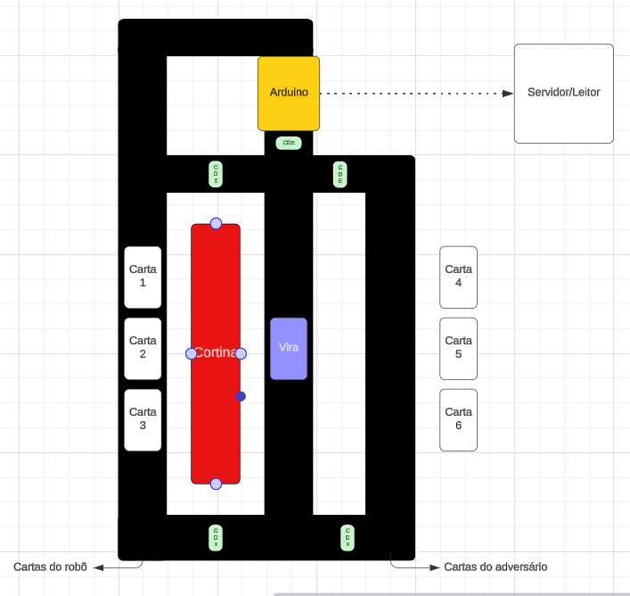
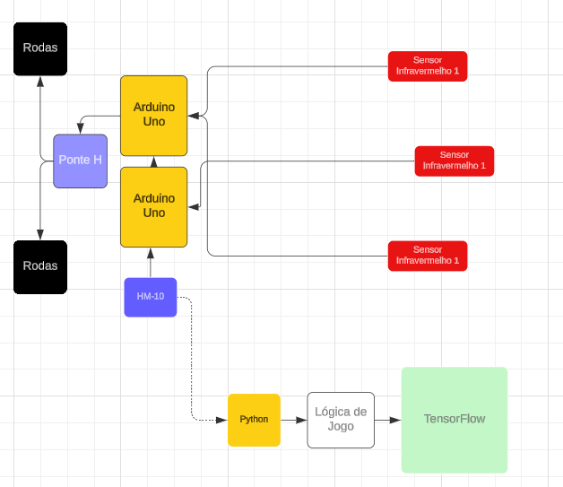

# Truco With Arduino
Saudações! Sejam todos bem-vindos a documentação do robõ que joga truco! É até um tanto engraçado falar a respeito de um projeto desse. Estamos publicando esse projeto enquanto em nosso tempo de faculdade, o que já explica muita coisa a respeito da motivação para cria-lo. Neste documento, irei explicar como tanto a parte de hardware como a de software funciona, as vantagens, desvantagens, e como você pode replica-lo.

# Sumário
- [Motivação](#Motivação)
- [Resumo](#Resumo)
- [Arduino e Servidor](#Arduino-e-Servidor)
- [Explicando um Jogo](#Explicando-um-Jogo)
- [Treinamento](#Treinamento)
- [Mecanismo de rota](#Mecanismo-de-rota)

# Motivação
Tirando toda a brincadeira por trás. Esse projeto está sendo realizado como parte de um dos trabalhos realizados no InovaTech, o programa de inovação e tecnologia do curso de Sistemas de Informação da Unipar. O objetivo principal do projeto é botar em prática a aplicação de estudos a cerca de Inteligência Artificial e Lógica de Programação, visando criar um sistema complexo, porém eficiente e, principalmente, inteligente.

# Resumo
De forma introdutória, apresentarei o projeto seguindo este desenho inicial.

### Elementos
- **Arduino**: Robõ em formato de carro, que se movimentará por cima das cartas lendo e decidindo o jogo. O explicaremos mais detalhadamente mais a diante.
- **Servidor/Leitor**: A cabeça do arduino. É o servidor que irá processar as informações recebidas pelo arduino, retornando o que o mesmo deve fazer. Ele é feito em Python, e utilizará inteligência artificial para transformar o array de dados do arduino na resposta de qual carta foi lida.
- **Cartas (de 1 até 6)**: As cartaz recebidas pelos jogadores, sendo de 1 até a 3 pertencentes ao robô e, de 4 a 6, ao seu adversário.
- **Vira**: Carta da qual é necessária para ser setada a carta mais poderosa daquela partida.
- **Cortina**: Nome dado a barreira criada para que o adversário do robô não possa ver as cartas.
- **CDD**: Abreviação de "Controlador de Direção". Ajudará o arduino a seguir pelos caminhos que ele necessita para determinada função. Será feito por meio de um código de barras, que, ao ser detectado, informa ao arduino aonde ele se encontra e para onde deve ir dependendo de qual sua ação no momento.

# Arduino e Servidor
Aqui será explicado um pouco da parte tanto de hardware como um pouco da lógica de software do projeto. Não imcorporaremos o encaixe de fios (ou jumpers), tampouco uma organização de protoboard. Este fluxo abaixo somente será útil para se obter um entendimento maior acerca do funcionamento do robô.

- **Arduino Uno**: No projeto, é utilizado dois Arduinos ao invés de somente um, pelo motivo da placa não ser muito boa lidando com dois processos simultâneos que requerem muita eficiência, que são a comunicação Bluetooth e a atividade de seguir a linha. Tendo isso em mente, foi separado um Arduino para cuidar de toda a lógica para seguir a linha, que encontra o melhor trajeto para o que deseja fazer pela sua comunicação com o outro Arduino, esse responsável exclusivamente pela comunicação com o Servidor.
  
- **Sensor Infravermelho**: Possuímos 3 sensores no projeto. Os 2 sensores nos cantos são responsáveis por manter o carrinho na linha, por isso são ligados no mesmo Arduino que cuida dos motores. O do meio, responsável pela leitura das cartas, é ligado diretamente no Arduino responsável pela comunicação Bluetooth.
  
- **HM-10**: Módulo Bluetooth 4.0, também chamado de BLE. é responsável pela comunicação Bluetooth entre o robô e servidor.
  
- **Ponte H**: Placa que controla a tensão para os motores.
  
- **Python/Lógica/TensorFlow**: Servidor dos dados. É ele quem recebe os dados em formato de array pelo Arduino e envia a Rede Neural fazer a predição da carta. Além disso, ele também cuida das tomadas de decisão acerca de quais cartas serão escolhidas pelo Arduino. No fluxograma aparece que um está na frente do outro, mas na prática os dois podem assumir qualquer uma das posições, ou seja, analisar pela rede neural e depois verificar a lógica, ou analisar a lógica e somente depois verificar a rede neural.

# Explicando um Jogo
Nesta seção será explicado passo a passo como funciona uma partida do jogo com o Arduino.

- **Início**: O Arduino deve estar em sua posição inicial. O adversário deve embaralhar as cartas, entrega-las para ambos e mostrar a carta "Vira", e assim ligar o arduino. A primeira coisa que o robô fará é escolher quem irá começar o jogo aleatoriamente, mostrando isso por meio de bips, sendo 1 bip para ele começando e 2 bips para você começando. Caso ele começe, irá ler todas as cartas contidas no jogo. E então irá voltar para sua posição inicial.
  
- **Primeiro passo**: Assim feito, irá sinalizar qual carta ele irá escolher por meio de bips, sendo a ordem que ele leu sinalizada na mesa do jogo. O sistema ainda não comporta mecanismos para o robô mover a carta, sendo necessário, no momento, uma pessoa externa ao jogo mover a carta para ele ou o próprio adversário, sem ver a carta, pegar a carta escolhida pelo robô. Esse realmente não é um dos melhores métodos para resolver esse problema, mas é bom termos em mente que o intúito do projeto é realizar um estudo sobre Inteligência Artificial e lógica de programação. Após o arduino apitar sua escolha de carta, terá um certo tempo que seja posicionado a carta escolhida e, tendo acabado esse tempo, ele apitará para o adversário realizar sua jogada.
  
- **Segundo passo**: Após o apito, o adversário irá ter um certo tempo para escolher e posicionar sua carta na mesa, tendo acabado esse tempo, o arduino passará novamente visualizando a mesa para ver qual carta a pessoa jogou. Após isso, retornará ao seu ponto inicial.
  
- **Terceiro passo**: Chegando em seu ponto inicial, irá repetir o primeiro e o segundo passo até a última rodada, dependendo do andamento do jogo. Após o término da partida, irá emitir um bip característico.

# Mecanismo de rota
A lógica por trás dos caminhos que o robô fará dependeria de 3 fatores: Sua localização atual, sua localização anterior e o que ela necessita fazer no momento. Em outras palavras,

# Treinamento
O sistema de treinamento é essencial para termos uma base de dados do dado bruto das cartas com seus respectivos valores. Não é o Arduino que processa as informações, mas somente envia elas para o servidor para que o mesmo processe tanto o jogo como a leitura das cartas. O processo de treinamento é simples.

